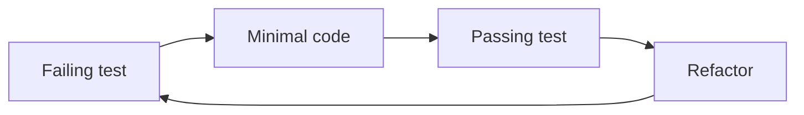

# TDD in practice

This assignment deals with statistics computed from batches of data from an IoT weight-sensor.

## Specification as tests

This assignment has the specification in tests. Write minimal code to pass those tests.
Implement the data structure and input validation - based on the asserts.

You could encounter many requests for extending the functionality in future - additional data-sources, statistics to be computed, and actions to be taken.

Tip: Do not over-engineer. Write minimal code _just enough_ to pass the tests.

Pick the assignment in your language. Don't forget to read the README.md.

[C++](https://classroom.github.com/a/9S-1-1PC)

[C#](https://classroom.github.com/a/3R2HGSjg)

[Java](https://classroom.github.com/a/qn9yGH0w)

[Python](https://classroom.github.com/a/CLntROnm)

[JavaScript](https://classroom.github.com/a/NP8bEXoL)
