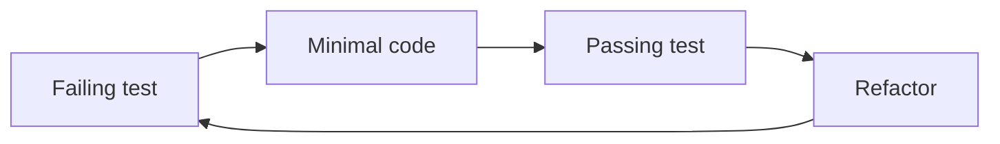

# TDD in practice

## Specification as tests

This assignment has the specification in tests. Write minimal code to pass those tests.
Design the data structure and input validation, based on the asserts.

Food for thought: What else can go wrong? Can you think of more tests?

Pick the assignment in your language. Don't forget to read the README.md.

[C++](https://classroom.github.com/a/wBQWExFa)

[C#](https://classroom.github.com/a/7El3TZD-)

[Java](https://classroom.github.com/a/k7RjbW4c)

[Python](https://classroom.github.com/a/S6F3-QWk)

[JavaScript](https://classroom.github.com/a/uuqlI8Cx)
