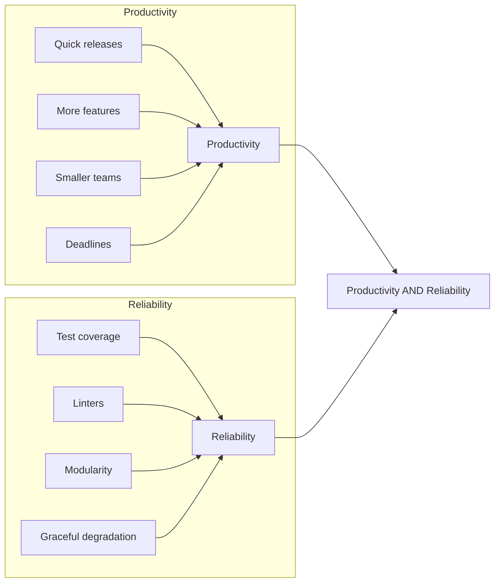

# Course transcripts

This page covers the concepts covered in the exercises

## Purpose

Build habits for productivity and reliability.

## Tests

Follow the FIRST principles for writing tests:

| Principle | Enables | Benefits |
|-----------|---------|----------|
| Fast      | Frequent execution | Find issues early |
| Independent| Isolation of tests | Easier failure diagnosis |
| Repeatable | Consistent results | Stable tests, low maintenance |
| Self-validating| Automatic pass/fail | Reduced manual effort - single Pass/Fail result |
| Thorough   | Coverage with strong asserts | Passing tests ensure customer satisfaction |
