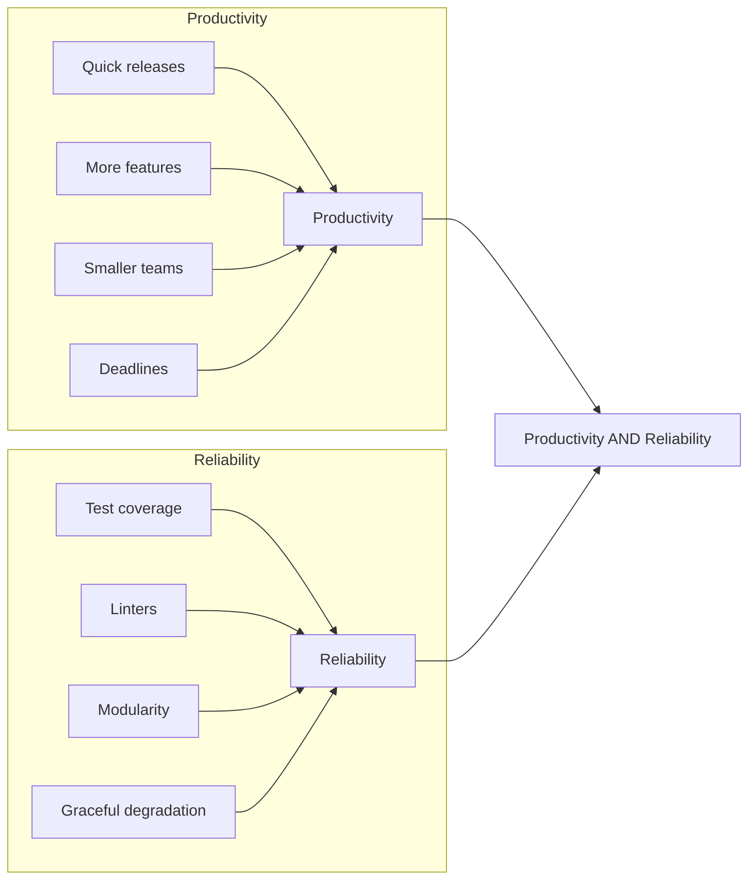

# Course transcripts

This page covers the concepts covered in the exercises

## Purpose

Build habits for productivity and reliability.

## Tests

Follow the FIRST principles for writing tests:

| Principle | Enables | Benefits |
|-----------|---------|----------|
| Fast      | Frequent execution | Find issues early |
| Independent| Isolation of tests | Easier failure diagnosis |
| Repeatable | Consistent results | Stable tests, low maintenance |
| Self-validating| Automatic pass/fail | Reduced manual effort - single Pass/Fail result |
| Thorough   | Coverage with strong asserts | Passing tests ensure customer satisfaction |

## Modularity

Modularity is the practice of breaking down code into smaller pieces. This makes it easier to understand, test, and maintain. 

However, cutting code arbitrarily can lead to confusion. Principles that help in a beneficial cut:

### Separate by lifecycle

Keep stable code separate from evolving code.
The feature to "display the color manual" can change by user-preference.
Hence, separate it from "color-pair mapping", which goes by the standard.

### Name by purpose

Names for files, classes, or functions should be self-evident.
A good name conveys purpose - without digging further into their code or comments.
This saves time when reading code.

### Avoid side effects

Side effects are changes to state - display, storage, network, etc.
They bring dependency. Isolate your logic into pure functions that return a value without changing the state.
Keep dependencies separate.

### Inject dependencies

When it isn't possible to isolate with pure functions, inject dependencies.
Pass in the dependencies as parameters, rather than hardcoding them.
This makes it easy to mock the dependencies in tests, and to swap them out in production.

## Integration

So you've made the parts decoupled and testable - into functional modules. You have high confidence in them working.
How can you put them together? Choose your option based on the situation:

### Procedural sequence

A function calls the functional modules in a fixed order.

Use when the steps are linked by nature. E.g., if you need to authenticate every time before calling a particular API.

But it quickly runs into complexity with variations. E.g., if there are multiple types of authentication possible.

### Configurable pipeline

Instead of the function calling a fixed sequence, let it read the individual steps from a configuration file.

Then you can configure from a choice of individual steps. E.g., the type of authentication required by a particular consumer.

But there is more indirection now, hard to figure out when a consumer reports an issue. Make sure to have the configuratio source-controlled.

### Strategy pattern (plugins)

Delegate to interchangeable modules ([strategies](https://refactoring.guru/design-patterns/strategy))

Use it when contracts are clearly defined with deprecation strategies. Then it gives the benefit of new methods without touching core logic.

But be aware that a consumer can pick a logic that wasn't tested (impossible to test all combinations in all situations - that's the importance of the contract)

### Orchestrator / Workflow Engine

A central controller determines which module to call next.

This method helps when the configuration of the central controller follows a "Domain Specific Language" (DSL). So consumers can specify behavior in their language, while still having deterministic flow.

But the orchestrator can become a "god object" over time, requiring experts to trouble-shoot DSLs. It will not be possible to grow teams working with DSLs quickly.

### Pub-sub / Choreography

Modules subscribe to events, which are emitted by other modules.

Supports fan-out of events. E.g., a sensor can publish temperature, subscribed to by the alerting as well as logging modules.

But it's harder to trace control flow, and the order of delivery may vary

### Message queues

A shared queue is used to line up messages to be processed by suitable modules. Loss of message is prevented.

It scales well and is naturally extensible.

But testing end-to-end behavior is complex, debugging flow requires tooling.

### Natural language-based orchestration (MCP)

Let consumers describe behavior in their own language, relying on an AI Agent (LLM) to interpret and route to your individual modules.

Consumers can try new things without having developers in the loop.

But being probabilistic models, they often deliver different results in successive runs.
